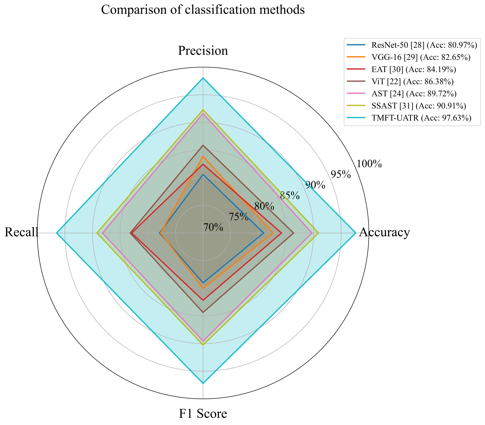

# Multimodal Fusion Transformer for Enhanced Underwater Acoustic Target Recognition

This repository contains the official implementation for the paper **"Multimodal Fusion Transformer for Enhanced Underwater Acoustic Target Recognition"**.

This project introduces a tri-modal fusion transformer (TMFT-UATR) that integrates **audio**, **image**, and **text** modalities to address the challenges of underwater acoustic target recognition, such as complex environments and limited data. Our model demonstrates the effectiveness of multimodal learning, with experimental results showing significant improvements over baseline methods.

## Model Architecture

The TMFT-UATR model is built upon a powerful transformer-based architecture that processes and fuses information from three distinct modalities.

1.  **Audio-Visual Branch**: Utilizes a fine-tuned Cross-modal Audio-Visual Masked Autoencoder (**CAV-MAE**) as its backbone. The model processes spectrograms (as images) for audio and standard images for visual input, generating powerful, aligned representations.

2.  **Text Branch**: Employs a pre-trained **BERT** model to generate contextual embeddings from descriptive text data associated with the acoustic signals.

3.  **Fusion Core**: The outputs from the audio, visual, and text branches are enriched with modality-specific embeddings and then fed into a central **Transformer Encoder**. This module performs deep fusion, allowing the model to capture complex cross-modal interactions and learn a comprehensive, unified representation.

4.  **Contrastive Learning**: To further enhance the alignment of representations from different modalities, the model is trained with a **contrastive loss**. This encourages the embeddings of corresponding audio, visual, and text samples to be closer in the feature space, improving the quality of the fusion.

The overall architecture is illustrated below:


## Key Features

-   **Tri-modal Fusion**: Effectively combines audio, image, and text data for robust target recognition.
-   **Transformer-based Architecture**: Leverages the power of self-attention for both single-modality feature extraction and cross-modality fusion.
-   **Pre-trained Backbones**: Builds upon strong pre-trained models (CAV-MAE and BERT) to achieve high performance even with limited data.
-   **Contrastive Loss**: Improves multimodal representation alignment for better fusion and classification.

## File Structure

The repository is organized as follows:

```
.
├── src
│   └── models
│       ├── model.py            # Main TMFT model definition, combining all modalities.
│       ├── cav_mae.py          # Core Audio-Visual backbone model (CAV-MAE).
│       ├── pos_embed.py        # Positional embedding generation for transformers.
│       └── text_embedding.py   # Legacy RNN-based text embedding (alternative).
└── utils
    ├── contrastive_loss.py # Implementation of the contrastive and combined loss functions.
    ├── dataloader.py       # Data loader for text data.
    ├── text_process.py     # Text preprocessing pipeline.
    ├── process_image.py    # Image loading and preprocessing utilities.
    ├── vocab.py            # Vocabulary building script.
    ├── ema.py              # Exponential Moving Average for model weights.
    └── helper.py           # Helper functions (e.g., weight decay).
```

## Usage

### Prerequisites

-   Python 3.8+
-   PyTorch
-   Transformers
-   timm
-   Pandas
-   NumPy

### Data Preparation

1.  Organize your audio files, images, and a CSV file containing text descriptions.
2.  Update the data loading and processing scripts in `utils/` to match your dataset's structure.

### Pre-trained Models

Download the pre-trained weights for the CAV-MAE backbone and the BERT model. Update the paths in `src/models/model.py`:

```python
# in src/models/model.py
audio_visual_weight = 'path/to/your/cav-mae-weight.pth'
bert_weight = 'path/to/your/bert-base-uncased' # or other BERT model directory
```

### Training

To train the model, create your own training script:

```bash
python train.py --config configs/my_config.yaml
```

## Acknowledgements

This implementation builds upon the following outstanding projects:
-   [CAV-MAE: Cross-modal Audio-Visual Masked Autoencoder](https://github.com/YuanGongND/cav-mae)
-   [Hugging Face Transformers](https://github.com/huggingface/transformers)
-   [PyTorch Image Models (timm)](https://github.com/rwightman/pytorch-image-models)
